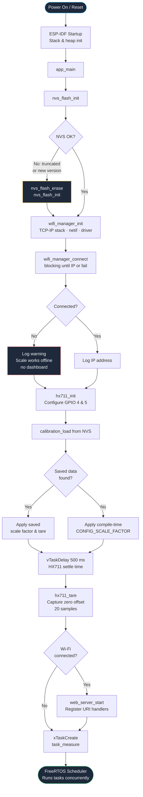
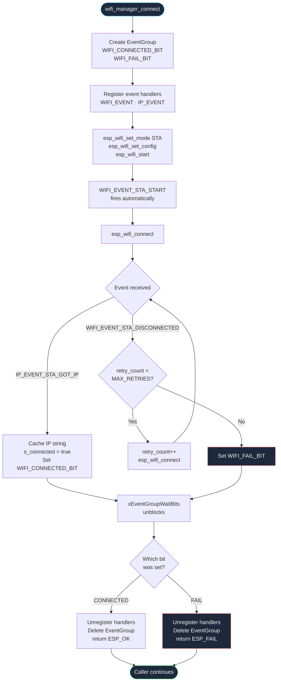
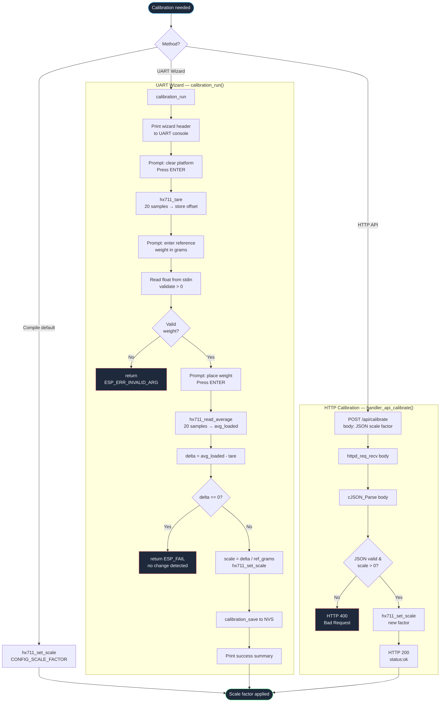
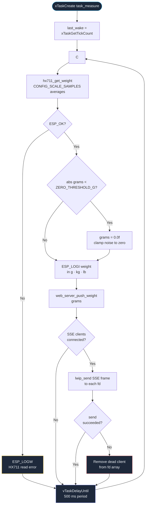
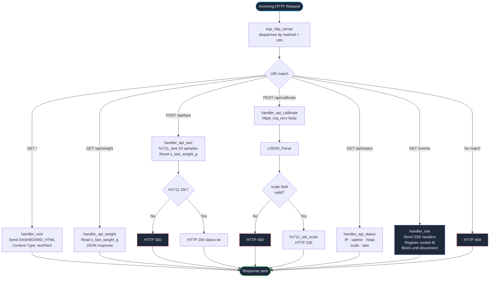
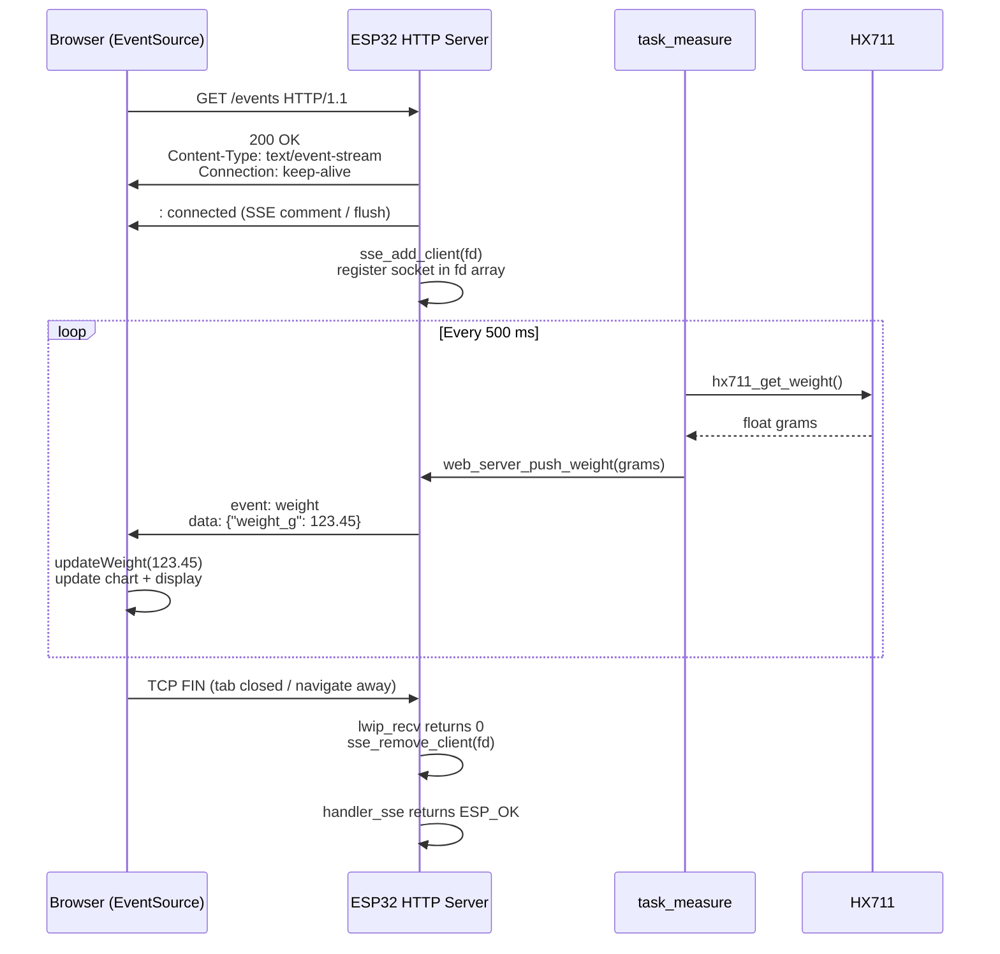
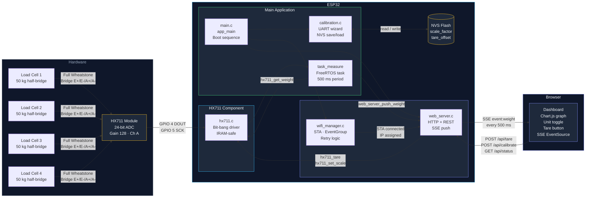

# ESP32 Digital Scale — Flowcharts

Complete system flowcharts for the ESP32 Digital Scale project, written in
[Mermaid](https://mermaid.js.org/) syntax. GitHub renders these natively in
any Markdown file.

---

## Table of Contents

1. [System Boot Sequence](#1-system-boot-sequence)
2. [Wi-Fi Connection Manager](#2-wi-fi-connection-manager)
3. [HX711 Initialisation & Raw Read](#3-hx711-initialisation--raw-read)
4. [Calibration Flow](#4-calibration-flow)
5. [Measurement Task (FreeRTOS Loop)](#5-measurement-task-freertos-loop)
6. [Web Server & REST API Routing](#6-web-server--rest-api-routing)
7. [Server-Sent Events (SSE) Lifecycle](#7-server-sent-events-sse-lifecycle)
8. [NVS Calibration Persistence](#8-nvs-calibration-persistence)
9. [Full System Architecture](#9-full-system-architecture)

---

## 1. System Boot Sequence

`app_main()` orchestrates the entire startup in strict order before handing
control to the FreeRTOS scheduler.

---

## 2. Wi-Fi Connection Manager

`wifi_manager_connect()` uses a FreeRTOS **EventGroup** to block the caller
until the station obtains an IP address or exhausts its retry budget.

---

## 3. HX711 Initialisation & Raw Read

The driver configures GPIO then performs a time-critical bit-banged read
with interrupts disabled.

```mermaid
flowchart TD
    subgraph INIT ["hx711_init()"]
        A([Call hx711_init]) --> B{dev & cfg\nnot NULL?}
        B -- No --> C[return\nESP_ERR_INVALID_ARG]
        B -- Yes --> D[Copy config to dev\ntare=0 · scale=1.0]
        D --> E[gpio_config SCK\nOUTPUT · initial LOW]
        E --> F{GPIO OK?}
        F -- No --> G[return error]
        F -- Yes --> H[gpio_config DOUT\nINPUT · floating]
        H --> I{GPIO OK?}
        I -- No --> G
        I -- Yes --> J[return ESP_OK]
    end

    subgraph READ ["hx711_read_raw()"]
        K([Call hx711_read_raw]) --> L[hx711_wait_ready\npoll DOUT every 1 ms]
        L --> M{DOUT LOW\nwithin 1000 ms?}
        M -- No --> N[return ESP_ERR_TIMEOUT]
        M -- Yes --> O[portDISABLE_INTERRUPTS]
        O --> P["Clock 24 bits MSB-first\nSCK HIGH 1µs → sample DOUT\nSCK LOW 1µs → shift into data"]
        P --> Q["Send N gain-select pulses\n1=A/128 · 2=B/32 · 3=A/64"]
        Q --> R[portENABLE_INTERRUPTS]
        R --> S{Bit 23 set?\nsign bit check}
        S -- Yes --> T["data &#124;= 0xFF000000\nsign extend to int32"]
        S -- No --> U
        T --> U[return raw int32\nESP_OK]
    end

    style A fill:#1e293b,stroke:#38bdf8,color:#f1f5f9
    style K fill:#1e293b,stroke:#38bdf8,color:#f1f5f9
    style C fill:#1e293b,stroke:#f87171,color:#f1f5f9
    style G fill:#1e293b,stroke:#f87171,color:#f1f5f9
    style N fill:#1e293b,stroke:#f87171,color:#f1f5f9
    style U fill:#1e293b,stroke:#4ade80,color:#f1f5f9
    style J fill:#1e293b,stroke:#4ade80,color:#f1f5f9
    style O fill:#1e293b,stroke:#fbbf24,color:#f1f5f9
    style R fill:#1e293b,stroke:#fbbf24,color:#f1f5f9
```

---

## 4. Calibration Flow

Two calibration paths exist: the **interactive UART wizard** (first-time setup)
and the **HTTP API** (remote / in-field updates). Both persist to NVS.

---

## 5. Measurement Task (FreeRTOS Loop)

`task_measure` runs at priority 5, waking every 500 ms via
`vTaskDelayUntil()` for deterministic timing.

---

## 6. Web Server & REST API Routing

`web_server_start()` registers six URI handlers. Every incoming HTTP request
is dispatched by the esp_http_server task pool.

---

## 7. Server-Sent Events (SSE) Lifecycle

SSE keeps a persistent HTTP connection open. The browser's `EventSource`
receives a `weight` event every 500 ms without polling.

---

## 8. NVS Calibration Persistence

Scale factor and tare offset survive power cycles by reading and writing to
ESP32 Non-Volatile Storage flash partition.

```mermaid
flowchart TD
    subgraph SAVE ["calibration_save()"]
        A([Call save]) --> B[nvs_open READWRITE\nnamespace: scale_cfg]
        B --> C{Open OK?}
        C -- No --> D[return NVS error]
        C -- Yes --> E[Bit-cast float scale\nto uint32_t]
        E --> F[nvs_set_u32\nkey: scale_factor]
        F --> G[nvs_set_i32\nkey: tare_offset]
        G --> H[nvs_commit]
        H --> I[nvs_close]
        I --> J[return ESP_OK]
    end

    subgraph LOAD ["calibration_load()"]
        K([Call load]) --> L[nvs_open READONLY\nnamespace: scale_cfg]
        L --> M{Namespace\nexists?}
        M -- No --> N[return\nESP_ERR_NVS_NOT_FOUND]
        M -- Yes --> O[nvs_get_u32\nkey: scale_factor]
        O --> P{Key found?}
        P -- Yes --> Q[Bit-cast uint32_t\nback to float\nhx711_set_scale]
        P -- No --> R[Skip — keep default]
        Q --> S[nvs_get_i32\nkey: tare_offset]
        R --> S
        S --> T{Key found?}
        T -- Yes --> U[dev->tare = value]
        T -- No --> V[Skip — tare stays 0]
        U --> W[nvs_close\nreturn ESP_OK]
        V --> W
    end

    subgraph ERASE ["calibration_erase()"]
        X([Call erase]) --> Y[nvs_open READWRITE]
        Y --> Z[nvs_erase_key scale_factor\nnvs_erase_key tare_offset]
        Z --> AA[nvs_commit · nvs_close]
        AA --> AB[return ESP_OK\nNext boot uses defaults]
    end

    style A fill:#1e293b,stroke:#38bdf8,color:#f1f5f9
    style K fill:#1e293b,stroke:#38bdf8,color:#f1f5f9
    style X fill:#1e293b,stroke:#38bdf8,color:#f1f5f9
    style D fill:#1e293b,stroke:#f87171,color:#f1f5f9
    style N fill:#1e293b,stroke:#fbbf24,color:#f1f5f9
    style J fill:#1e293b,stroke:#4ade80,color:#f1f5f9
    style W fill:#1e293b,stroke:#4ade80,color:#f1f5f9
    style AB fill:#1e293b,stroke:#4ade80,color:#f1f5f9
```

---

## 9. Full System Architecture

End-to-end view of all hardware, firmware components, tasks, and the browser
dashboard communicating together.

---

*Generated for ESP32 Digital Scale v1.0.0 — see [README.md](README.md) for full project documentation.*
